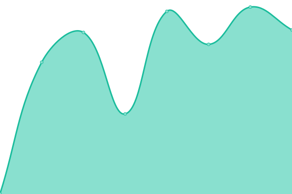

# [📈 Live Status](https://uptime.tennyy.com): <!--live status--> **🟧 Partial outage**

This repository contains the open-source uptime monitor and status page for [tennyy](https://uptime.tennyy.com), powered by [Upptime](https://github.com/upptime/upptime).

With [Upptime](https://upptime.js.org), you can get your own unlimited and free uptime monitor and status page, powered entirely by a GitHub repository. We use [Issues](https://github.com/tennyy/uptime/issues) as incident reports, [Actions](https://github.com/tennyy/uptime/actions) as uptime monitors, and [Pages](https://uptime.tennyy.com) for the status page.

<!--start: status pages-->
<!-- This summary is generated by Upptime (https://github.com/upptime/upptime) -->
<!-- Do not edit this manually, your changes will be overwritten -->
<!-- prettier-ignore -->
| URL | Status | History | Response Time | Uptime |
| --- | ------ | ------- | ------------- | ------ |
|  [WeWa](https://www.wewacard.com) | 🟩 Up | [we-wa.yml](https://github.com/tennyy/uptime/commits/HEAD/history/we-wa.yml) | 

 934ms
     
 | 

<a href="https://uptime.tennyy.com/history/we-wa">100.00%</a>
    

|  [PCL](https://www.primecredit.com) | 🟥 Down | [pcl.yml](https://github.com/tennyy/uptime/commits/HEAD/history/pcl.yml) | 

 122ms
     
 | 

<a href="https://uptime.tennyy.com/history/pcl">0.00%</a>
    

|  [Promise](https://www.promise.com.hk) | 🟩 Up | [promise.yml](https://github.com/tennyy/uptime/commits/HEAD/history/promise.yml) | 

 1606ms
     
 | 

<a href="https://uptime.tennyy.com/history/promise">100.00%</a>
    

<!--end: status pages-->

[**Visit our status website →**](https://uptime.tennyy.com)

## 📄 License

- Powered by: [Upptime](https://github.com/upptime/upptime)
- Code: [MIT](./LICENSE) © [Anand Chowdhary](https://anandchowdhary.com), supported by [Pabio](https://pabio.com)
- Data in the `./history` directory: [Open Database License](https://opendatacommons.org/licenses/odbl/1-0/)
